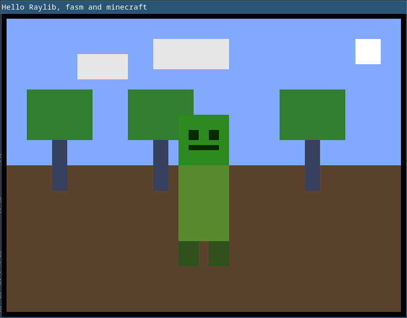

## Learning Assembly with Fasm and Raylib

Welcome to my journey of learning assembly language! In This project I learned how to use Fasm (Flat Assembler) to link external libraries,
and I've chosen to integrate it with Raylib, a simple and easy-to-use library for graphical applications.

### Why Assembly and Fasm?

Assembly language provides a low-level, close-to-hardware programming experience which is incredibly powerful for understanding the inner workings of computers.
Flat Assembler (Fasm) is a fast and efficient assembler that allows for easy linking with external libraries,
making it a great tool for learning and experimenting with assembly language.

### My Discovery Process

A big shoutout to [Tsoding](https://www.youtube.com/@TsodingDaily), an incredible programmer on YouTube,
whose videos inspired me to explore the possibilities of integrating external libraries with assembly language! 💡

### Code Overview

The code is rendering a simple Minecraft-inspired painting using low-level assembly programming.



### Requirements

- Install [Fasm](https://flatassembler.net/)
- Install [Raylib](https://www.raylib.com/)

### Run

```bash
make
make run
```
